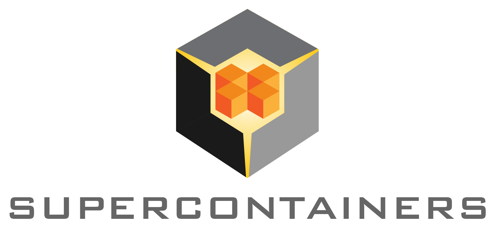

---
title: Intro
layout: template
filename: index
--- 

# Supercontainers Project

Container computing has revolutionized how many industries and enterprises develop and deploy software and services. Recently, this model has gained traction in the High Performance Computing (HPC) community through enabling technologies including [Shifter](https://www.nersc.gov/research-and-development/user-defined-images), [Singularity](https://singularity.hpcng.org/), [Charliecloud](https://charliecloud.readthedocs.io/en/latest), and Docker.  In this same trend, container-based computing paradigms have gained significant interest within the [DOE](https://www.energy.gov)/[NNSA](https://www.energy.gov/nnsa/national-nuclear-security-administration) [Exascale Computing Project](https://exascaleproject.org/) (ECP). While containers provide greater software flexibility, reliability, ease of deployment, and portability for users, there are still several challenges in this area for Exascale.

The ECP Supercomputing *Containers* Project (called **Supercontainers**) uses a multi-level approach to accelerate adoption of container technologies for Exascale, ensuring that HPC container runtimes will be scalable, interoperable, and integrated into Exascale supercomputing across DOE. The core components of the Supercontainer project focuses on foundational system software research needed for ensuring containers can be deployed at scale, enhanced user and developer support for enabling ECP [Application Development](https://www.exascaleproject.org/research/#application) (AD) and [Software Technology](https://www.exascaleproject.org/research/#software) (ST) projects looking to utilize containers, validated container runtime interoperability, and both vendor and DOE facilities system software integration with containers.

## Acknowledgements

This research project is supported by the [Exascale Computing Project](https://exascaleproject.org/) (17-SC-20-SC), a joint project of the U.S. [Department of Energy’s Office of Science](https://www.energy.gov/science/office-science) and [National Nuclear Security Administration](https://www.energy.gov/nnsa/national-nuclear-security-administration), responsible for delivering a capable exascale ecosystem, including software, applications, and hardware technology, to support the nation’s exascale computing imperative.  

|  |  |  |  |

